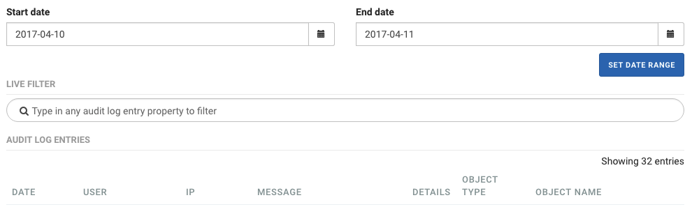

# Audit log

```text
Navigation: Audit Log
```

The audit log allows you to view all operations performed by administrators.

To view entries of audit log select`Audit Log` from the main menu.

Select the date range for the displayed information:

* **Start date** starting date
* **End date** End date

Confirm your choice with the `SET DATE RANGE` button.



The list of operations is displayed in a table consisting of the following columns:

* **DATE** Date of execution of the operation
* **USER** User performing the operations
* **IP** The IP address of the user performing the operation
* **MESSAGE** Description of the performed operation
* **DETAILS** Details of the operation \(if available \)
* **OBJECT TYPE** Type of the object on which the operation was performed
* **OBJECT NAME** Name of the object on which the operation was performed

