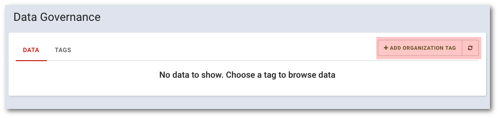

# Add organization tags

```text
Navigation: Data governance > ADD ORGANIZATION TAG
```

To add a new organization tag, select `Data governance` from the main menu, then click`ADD ORGANIZATION TAG` in the top right corner of the view.



Fill in the required fields describing the tag:


* **TAG NAME**
* **TAG DESCRIPTION**

Confirm adding a new tag by clicking the `ADD TAG` button

Now, new TAG can be used by all of your organization users.

