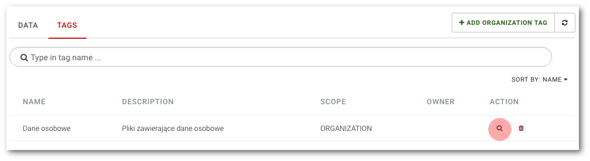

# Viewing data with the selected tag

```text
Navigation: Data governance -> TAGS
```

To display the list of data with the selected tag, select `Data governance` from the main menu, then click the TAGS tab and select the magnifying glass icon.



You will be moved to the DATA view where you will see a list of all the files and their owners with the selected tag:


