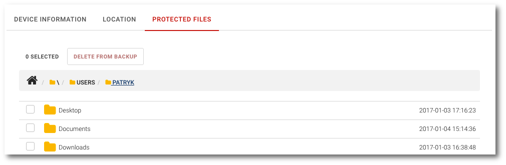
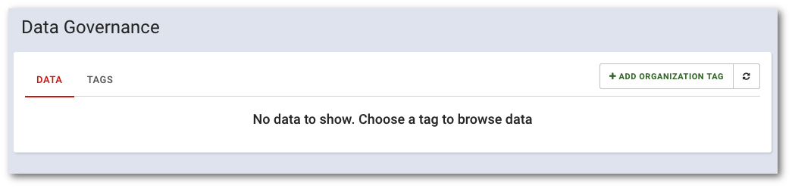
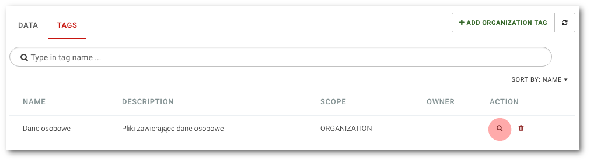

# Data management

Here you will find informations how to manage device data that are protected by KODO.

## List of protected data

```text
Portal navigation: Devices > Device name > PROTECTED FILES Tab
```

To preview the list of data protected from the select device, select `Devices` item from the main menu and then click the`PROTECTED FILES` tab.



The list is displayed as a tree view, which you can navigate through by clicking on specific item name.

The working path is displayed at the top of the list, clicking on the home icon will put you in the startup path.

## Restoring data from backup

**NOTE: "Allow administrators to restore user files" option need to turn on in policy assigned to device owner**

```text
Portal navigation: Devices > Device name > PROTECTED FILES Tab
```

To restore data from backup, select `Devices` from the main menu and then click `PROTECTED FILES` tab.

From here you can select file\(s\) and/or folder\(s\) that should you would like to restore from backup. Use the select box to choose item\(s\) and click `RESTORE FROM BACKUP` button, and confirm your action with the `OK` button


## Removing data from backup

**NOTE: Action of removing data from backup is irreversible**

```text
Portal navigation: Devices> Device name> PROTECTED FILES tab
```

To remove data from backup, select `Devices` from the main menu and then click `PROTECTED FILES` tab.

From here you can select file\(s\) and/or folder\(s\) that should be irreversible removed from backup. Use the select box to choose item\(s\) and click `DELETE FROM BACKUP` button, and confirm your action with the `OK` button.


## myKODO file tagging

Files that are stored in myKODO can be tagged. Tagging will help administrator track and organize stored data.

Tagging can be useful when determining file content \(e.g.: personal or confidential data\) and helps the administrator track the flow of data in the organization.

There are two types of tags:

* **Organization tag** - created by the administrator, can be used by organization users
* **User tag** -  created by the user, it's personal tag and is available only for him

From the administrative portal you can list all files which specific tag.

From this chapter you will learn:

* How to view tags and associated data
* How to create a new organization tag

### List tags

```text
Portal navigation: Data governance
```

To view a list of data and tags registered in the system, select `Data governance` from the main menu.



The view consists of two tabs:

* **DATA** List of files with the selected tag
* **TAGS** List of tags registered on the system

To view the list of tags registered in the system, click on the tab `TAGS`

 The tag list is displayed as a table with the following columns:

| COLUMN | DESCRIPTION |
| :--- | :--- |
| NAME | Tag name |
| DESCRIPTION | Tag description |
| SCOPE | Tag range: ORGANIZATION - for organization tags, USER - for private user tags |
| OWNER | The username to which the tag belong |
| ACTION | Actions on tags: magnifying glass icon - list of tagged data, bin icon - tag removal |

### List tagged data

```text
Portal navigation: Data governance > TAGS
```

To display the list of data with the selected tag, select `Data governance` from the main menu, then click the TAGS tab and select the magnifying glass icon.



You will be moved to the DATA view where you will see a list of all the files and their owners with the selected tag:


### Adding organization tags

```text
Portal navigation: Data governance > ADD ORGANIZATION TAG
```

To add a new organization tag, select `Data governance` from the main menu, then click`ADD ORGANIZATION TAG` in the top right corner of the view.


Fill in the required fields describing the tag:


* **TAG NAME**
* **TAG DESCRIPTION**

Confirm adding a new tag by clicking the `ADD TAG` button

Now, new TAG can be used by all of your organization users.

