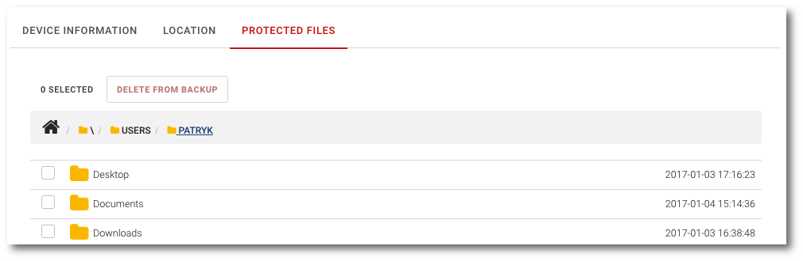

# Preview of protected data

```text
Navigation: Devices > Device name > PROTECTED FILES Tab
```

To preview the list of data protected from the select device, select `Devices` item from the main menu and then click the`PROTECTED FILES` tab.



The list is displayed as a tree view, which you can navigate through by clicking on specific item name.

The working path is displayed at the top of the list, clicking on the home icon will put you in the startup path.

