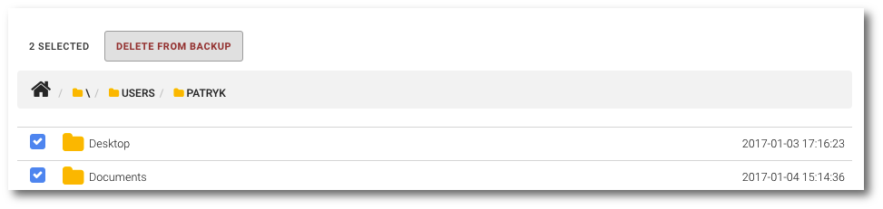

# Removing data from backup

**NOTE: Action of removing data from backup is irreversible**

```text
Navigation: Devices> Device name> PROTECTED FILES tab
```

To remove data from backup, select `Devices` from the main menu and then click `PROTECTED FILES` tab.

From here you can select file\(s\) and/or folder\(s\) that should be irreversible removed from backup. Use the select box to choose item\(s\) and click `DELETE FROM BACKUP` button, and confirm your action with the `OK` button.



