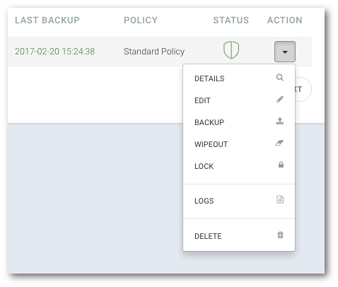
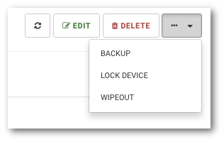
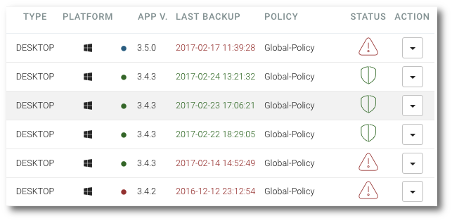

# device\_management

## Devices management

Each device with a KODO client installed and logged in at least once will be registered and listed in the device list.

### Device registration

A new device is registered to the system automatically at the first log in to the system.

### Device statuses

Each device registered in the system has status representing its current state.

Possible device status in the system:

* **Protected**  Status presented with a green shield icon. Indicates that the device is active and that the device's last communication time did not exceed the value given in the policy assigned to the device owner.
* **Not protected**  Status represented by the red triangle icon. Indicates that the device is active, but the last communication time of the device has exceeded the value specified in the policy assigned to the device owner.
* **Waiting for activation**  Status presented by the red hourglass icon. Indicates that the device is inactive and is awaiting for activation by the administrator.
* **Locked**  Status presented with a red padlock icon. Indicates that the device is locked.

### List devices

```text
Portal navigation: Devices
```

To view the list of registered devices, select `Devices` from the main menu.


The list of devices is displayed as a table with the following columns:

| COLUMN | DESCRIPTION |
| :--- | :--- |
| NAME | Registered device name |
| USER | Name of the device owner |
| PLATFORM | The type of operating system platform represented by an icon |
| APP V | Version of the application installed on the device |
| LAST BACKUP | Date of last device backup |
| POLICY | Protection policy assigned to the device owner |
| STATUS | Current device status |
| ACTION | Quick Action menu |

### Device activation

```text
Portal navigation: Devices > DEVICE NAME > ACTION MENU> Activate
```

After the user log in to system using mobile device for the first time, activation is required.

To activate a new device, select `Devices` from the main menu and click the arrow of the Quick Action menu, select `ACTIVATE` item from the menu.


### Sending backup request to mobile device

```text
Portal navigation: Devices > DEVICE NAME > ACTION MENU> BACKUP
```

To send a backup request to the device, select `Devices` from the main menu and click the arrow of the Quick Action menu, select `BACKUP` item from the menu.



### Last device localization

**NOTE: Location featuer is available only for mobile devices. Device location option need to turn on in policy assigned to device owner**

```text
Portal navigation: Devices > DEVICE NAME > LOCATION tab
```

To check the location of device during last backup session, select `Devices` from the main menu and click on the`LOCATION` tab.


## Device locking

```text
Portal navigation: Devices > DEVICE NAME > ... > LOCK DEVICE
```

To lock device and prevent logging from it, select `Devices` from the main menu and click the device name from the available list, click the `...` drop-down menu button and select `LOCK DEVICE`



### Blocked device unlocking

```text
Navigation: Devices > DEVICE NAME > ... > UNLOCK DEVICE
```

To unlock the device and allow logging from it, select `Devices` from the main menu and click the device name from the available list, click the `...` drop-down menu button and select `UNLOCK DEVICE`


### Detailed device information

```text
Portal navigation: Devices > DEVICE NAME
```

To view details about the device, select `Devices` from the main menu and click the device name from the list


**TIP: You can also use Quick Action** `DETAILS` **menu item to display informations about device.**

### Device name change

```text
Portal navigation: Devices > DEVICE NAME > EDIT
```

To change device name, select `Devices` from the main menu and click the device name from the list, click on the `EDIT` button


Confirm your changes by clicking on the `SAVE CHANGES` button

**TIP: You can also use Quick Action** `EDIT` **menu item to edit informations about device.**

### Removing device from KODO

 **NOTE: Removing the device from the system will result in the removal of all data protected from the device!** 

```text
Portal navigation: Devices > DEVICE NAME > DELETE
```

To remove a device from the system, select `Devices` from the main menu and click on the name of the device you want to delete, click on the `DELETE` button.


Confirm your action with the `Ok` key.

**TIP: You can also use Quick Action** `DELETE` **menu item to delete device.**

### Remote device wipeout

The KODO system allowsto remotely wipeout data from Android based devices.

**NOTE: This operation is irreversible and will wipeout data select to be protected by KODO and data offline stored in myKODO**

#### Performing wipeout

```text
Portal navigation: Devices > DEVICE NAME > ACTION MENU > WIPEOUT
```

To wipeout data from the device, select `Devices` from the main menu and click the device name from the available list, click on the `...` drop-down menu button and select `WIPEOUT`

Enter the master password and confirm the operation with the `Ok` button.

**TIP: You can also use Quick Action** `WIPEOUT` **menu item to wipeout data from the device.**

#### List performed wipeouts

```text
Portal navigation: Wipeout
```

To view a list of wipeouts performed on devices, select `Wipeout` from the main menu.

The list is displayed in a table consisting of the following columns:

| COLUMN | DESCRIPTION |
| :--- | :--- |
| DEVICE | Device on which data wipeout should be performed |
| USER | Owner of the device |
| PLATFORM | System platform od the device |
| DEVICE ID | System device ID |
| START DATE | Start date of wipeout action |
| START BY | Administartor name that started wipeout action |
| STATUS | Status of wipeout action |

**NOTE: The device must have access to network to receive the wipeout push notification**

### Desktop client version status

```text
Navigation: Devices
```

On the list of registered devices you can check version of currently installed client. Application version is indicated by number and colored dot.

Colored dot indicated application version:

* **Green color** - Installed client version is up-to-date.
* **Red Colour** - Installed client version is outdated.
* **Blue color** - Installed client version is newer than the current version configured for the system.



### Updating desktop client

```text
Portal navigation: Devices > ACTION MENU > Upgrade > UPGRADE NOW
```

**NOTE: KODO Client update feature via the administrative portal is available only for desktop devices**

To send an update to a device, select `Devices` from the main menu and use Quick Action `UPGRADE` menu item to send new client version to the device.\*\*

Select the version you want to install on selected device and click `UPGRADE NOW`


The KODO client will automatically download version of the application that has been selected by the administrator and the user will be notificated that the newer version is available. If user will not confirm installation of a new version, it will be installed automatically after KODO client is restarted.

**Hint: The upgrade process can take from several to tens of minutes depending on network speed**

