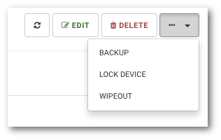
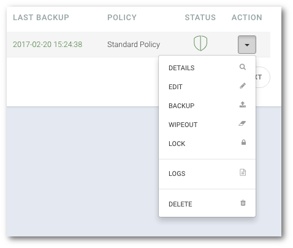

# Sending backup request to device

```text
Navigation: Devices > Device name > ACTION MENU> BACKUP
```

To send a backup request to the device, select `Devices` from the main menu and then:

* Click the device name from the available list, click the `...` drop-down menu button and select `BACKUP`

OR

* Click the arrow icon from the table ACTION menu and select `BACKUP` option from the dropdown menu.



