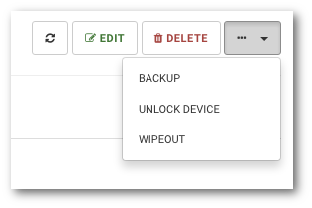

# Unlocking blocked device

```text
Navigation: Devices > ACTION MENU > Unlock device
```

To unlock the device and allow the user to login from it select `Devices` from the main menu and:

\*Click the device name from the available list, click the `...` drop-down menu button and select `UNLOCK DEVICE`



\*Click the arrow to the right of the table on the line with the device whose data you want to display select `UNLOCK` from the menu.


