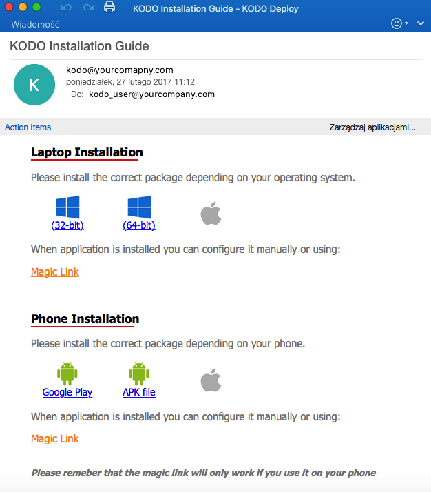

# Send installation instructions

```text
Navigation: Users> ACTION MENU> DEPLOY MOBILE / DESKTOP KODO
```

To send KODO client installation instructions, select `Users` from the main menu and then click the arrow to the right of the table on the line with the device whose data you want to display select`DEPLOY MOBILE KODO` or `DEPLOY DESKTOP KODO` from the menu.

You will be sent a KODO client installation instruction for the selected platform type.


**NOTE: Depending on your KODO server configuration, the email may include a link to download an APK file for Android devices, or a link to an application in the Google Play store. The application for the iOS platform is only available through the Apple AppStore.**



 _**Hint:**_  _To send a single message containing instructions for two types of platforms or to multiple users simultaneously, from the available list, select the user or users  \(check box next to the user name \) and then from the drop down menu_ `SEND DEPLOYMENT` _', Located above the list of users, select the appropriate item._

