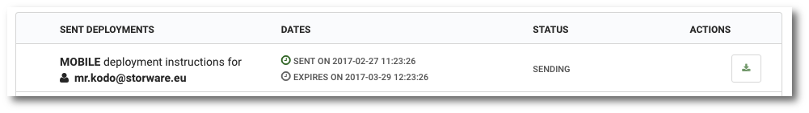

# Status of sent instructions

```text
Navigation: Deployment
```

To display a list of sent statements to users, select `Deployment` from the main menu.

The list of sent statements is displayed in the form of a table with the following columns:

*  **SENT DEPLOYMENTS**  Type of instruction and its recipient
*  **DATES**  Date of the instruction  \(SENT ON \) and Expiration Date of the "Magick Link"  \(EXPIRES ON \)
*  **STATUS**  Status of use of "Link Magick":
  * SENT - The instruction has been sent
  * CONFIRMED - Link used by the user
*  **DOWNLOAD**  Allows you to download the installation package sent to the client   _\(desktop only \)_ 



