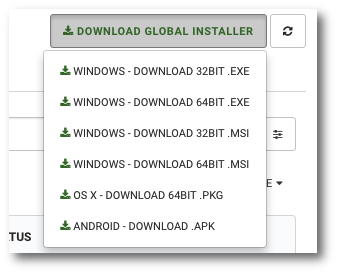

# Downloading client installer

```text
Navigation: Deployment> DOWNLOAD GLOBAL INSTALLER
```

To download the KODO client installation, select `Deployment` from the main menu and then click`DOWNLOAD GLOBAL INSTALLER`.

From the menu that appears, download the appropriate installation version of the client.



