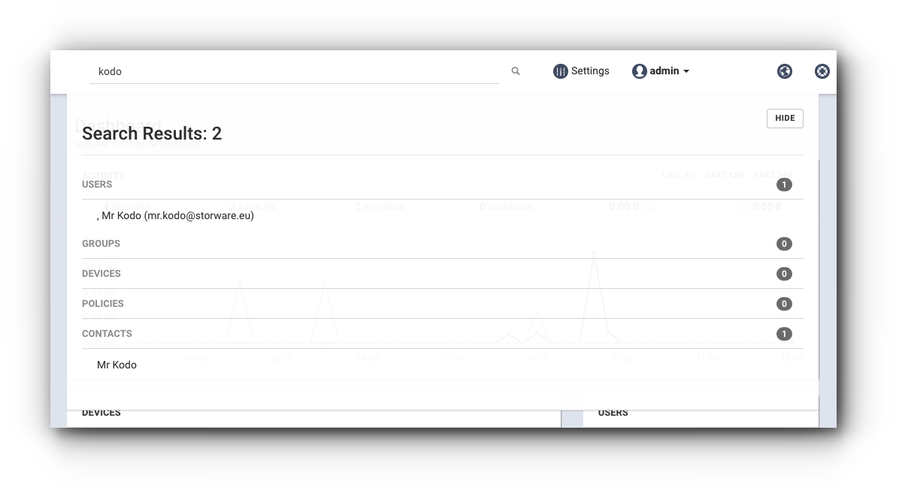

# management\_portal

## Management portal

The management portal is your central point to manage KODO environment. It's used for functions such as KODO configuration, user, devices and data managment, logging, and reporting. Managemnt portal is web based and you can get access to it using web browser.

### Supported web browsers

* Microsoft Edge
* Mozilla Firefox
* Google Chrome
* Safari

Browser must have javascript enabled.

### Access to the portal

Type in the web browser the following address, where **portal\_address** represents the IP address or domain name of the KODO server.

```text
https://portal_address
```

_**KODO administrative portal use Secure Socket Layer to encrypt connection, so the HTTPS prefix is mandatory.**_


### Log in to the portal

To log in to the portal, use the login and password that were created for your organization.


### Structure of the portal

The portal consists of the following elements:

#### Top bar

* Search engine
* Settings
* Administrator last login information/logout
* Link to the support portal
* Link to the producer website


#### Main menu

The main menu is on the left side of the portal and allows you to navigate between sections.

| MENU ITEM | DESCRIPTION |
| :--- | :--- |
| Dashboard | General system reports and informations |
| Users | Users detail informations and management |
| Devices | Devices and backup data management |
| Sessions | Listing of client sessions to server |
| Deployment | Client deployment infromations and client installation download |
| Shares | Administrative files and backup data sharing |
| Policies | Data protection policies |
| Wipeouts | Informations about wipeouts performed on devices |
| Contacts | Corporte Adress Book management |
| Administrators | Organization administrators managament |
| Audit log | Informations about actions performed on KODO system |
| Data governance | File tagging management |

### Search

The portal top bar contains a global search, start typing to search for the through following system objects:

* Users
* Groups
* Devices
* Policies
* Contacts



## Logout

To logout from the portal, click on the name of your administrative user in the top portal bar, then select `LOG OUT`.


