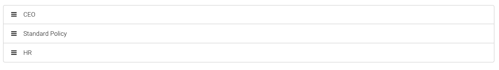

# Policy priority settings

Except user own policy he can also have assigned group policy. Priority will determine which policy will used for him, the higher the number, the higher the priority.

To modify policy priorities, go to the list of policies and then click on `MANAGE PRIORITY`

Grab the selected polic and move \(grab and drop\) it to the selected position. The higher the policy is, the higher priority will be assigned.

