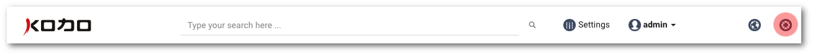

# Getting started with management portal

## Access to the administrative portal

Management portal is web based and you can get access to it using web browser. Type in the web browser the following address, where _portal\_address_ represents the IP address or domain name of the KODO server.

```text
https://portal_address:5000
```


By default administrative portal is listening on port 5000



_KODO administrative portal use Secure Socket Layer to encrypt connection, so the HTTPS prefix is mandatory._


## Supported web browsers

|  | **Google Chrome \(latest version\)** | **Mozilla Firefox \(latest version\)** | **Microsoft Edge** | **Apple Safari** |
| :--- | :--- | :--- | :--- | :--- |
| MacOS | Supported | Supported | N/A | Supported |
| Linux | Supported | Supported | N/A | N/A  |
| Windows | Supported | Supported | Supported | N/A |

## How to log in

To log into the administration portal, use the login and password that were created for your instance or organization.


### Last login information

To view information about last login for your administrative portal user, click the name of your admin user in the top portal bar.

The following information is available

* **LAST LOGIN -** date and time of the last successful login
* **LAST FAILED LOGIN -** date and time of the last failed login 
* **LAST FAILED LOGIN IP -** IP address of the last unsuccessful login attempt 



You can see more information about administrators login in Audit Log


## Search

The portal top bar contains a global search, start typing to search through the following system objects:

* Users
* Groups
* Devices
* Policies
* Contacts


## How to log out

To logout from the portal, click on the name of your administrative user in the top portal bar, then select `LOG OUT`.

## Support contact

Use Lifebuoy icon located in top right corner to go to support webpage. 



## Producer website

To contact with system provider use Earth icon located in top right corner.


