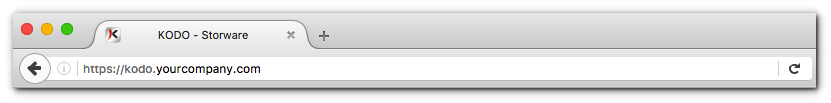

# Access to the administrative portal

Type in the web browser the following address, where _portal\_address_ represents the IP address or domain name of the KODO server.

```text
https://portal_address
```

**TIP:** _****KODO administrative portal use Sexure Socket Layer to encrypt connection, so the HTTPS prefix is mandatory._



