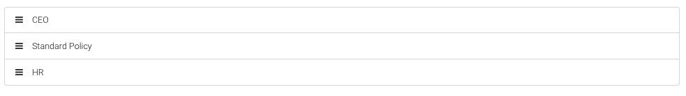

# Protection policies

Policy is a collection of configurations and backup strategy for devices.

An administrator can establish separate policies to meet the backup requirements for different kinds of data, such as:

* Company data that is critical for the business.
* User data that changes frequently
* Legal information that must be retained at longer period

## Data encryption

In the policy configuration you can turn on option that will allow user to encrypt data before they will leave his endpoint, encryption and key need to be configured on KODO client itself.

To encrypt protected data KODO is using the AES-256 algorithm.

If the backup copy of user device has been encrypted, data sharing and administrative data restore is no longer possible.

Data encyption setting can be enabled in general policy configuration.

## List policies

```text
Portal navigation: Policies
```

Select `Policies` from the main menu to display list of available policies.


Policy tables consist of the following columns:

| COLUMN | DESCRIPTION |
| :--- | :--- |
| POLICY NAME | Name of the policy |
| PRIORITY | Priority will determine which policy will used for user if the user belong to group\(s\) |
| USER COUNT | Number of users assigned to policy |
| DATA CREATE | Date of policy creation |
| CREATED BY | Name of administrative user who created the policy |
| DATE MODIFIED | Date of last policy modification |
| MODIFIED BY | Name of administrator who edited policy last |
| ACTION | Quick Action menu |

## Policy priority

Except user own policy he can also have assigned group policy. Priority will determine which policy will used for him, the higher the number, the higher the priority.

To modify policy priorities, go to the list of policies and then click on `MANAGE PRIORITY`


Grab the selected polic and move \(grab and drop\) it to the selected position. The higher the policy is, the higher priority will be assigned.



## Default policy

The default server policy has been marked at policies list **in bold**. Default policy will be used for all new users synced from external source.

## Adding new policy

```text
Portal navigation: Policies > ADD POLICY
```

To add a new protection policy, select `Policies` from the main menu and click on`ADD POLICY`.


Enter the name of the new policy in the `Policy name` field, configure the policy according to your requirements and the description in next chapter.

After configuring the policy save it by clicking the `ADD POLICY` button at the bottom of the page

## Policy configuration

In this section you will learn how to configure protection policy to meet your requierments.

The policy confgiuration is divided into tabs in which we will configure its individual aspects.

| TAB | Description |
| :--- | :--- |
| GENERAL | General policy settings |
| E-MAIL | Settings for e-mail client archive copy |
| WINDOWS | Settings for Continouse Dara Protection for Windows systems |
| OSX | Settings for Continouse Dara Protection for OSX and MacOS systems |
| ANDROID | Backup settings for Android based devices |
| IOS | Backup settings for iOS based devices |
| WINDOWS PHONE | Backup settings for Windows Phone based devices |

### General policy settings

```text
Portal navigation: Policies > POLICY NAME > GENERAL tab
```

* **Set as default policy** - Set policy as a default for newly synchronized users. Only one policy can be default.
* **Allow user do modify policy** - Allow to modify policy by the user. User policy modification does not affect global configuration created by administrator. Changes of policy apply only to device where the modification has been made.

**PRIVACY SETTINGS:**

* **Allow admin to restore user files** - if turned on administrator will be allowed to localy restore user backup data \(if not encrypted\)

**PASSWORD SETTINGS**

Allows to confgiure requirements for local users password like:

* Minimal password length
* Requirment for lower and upper case
* Reruirment for numbers and special characters

**MOBILE SETTINGS:**

Allows to configure general settings for mobile devices.

* **Allow backups only over WiFi** - turning this option on allow to perform backup operations only when device is connected to WiFi network
* **Require PIN authentication** - Always require PIN code when log in to the application, instead of password
* **Maximum session time** - Max. time which the KODO application can run in background without user re-authentication.
* **Retention period for file versions** - number of days for mobile file backup
* **Maximum number of file versions** - number of versions to maintain for mobile file backup

**MYKODO SETTNGS:**

A section for configuring myKODO feature

* **myKODO enabled** - Enable or disable myKODO on device
* **Windows location of myKODO folder** - Path to folder that will store myKODO data on Windows
* **macOS location of myKODO folder** - Path to folder that will store myKODO data on macOS
* **File link expiration** - The maximum lifetime for a link generated by user
* **Require password for file links** - Requirement to secure a data share link with a password
* **Allow sharing folders** - Allows to sharing myKODO folders with other KODO users
* **Allow sharing files via filelink** - Allows to sharing myKODO files sharing via web links, links can be shared outside the organization

**RISK NOTIFICATION SETTINGS:**

Configuration for user notifications if the device backup is not performed properly.

* **Send email notification for unprotected desktops** - Allows to turn on or off user e-mail notifications if his desktop device will change status to NOT PROTECTED
* **Show as desktop "Unprotected" after** - number of days, without dekstop device backup, after which the device status will be changed to NOT PROTECTED
* **Send email notification for unprotected mobiles** - Allows to turn on or off user e-mail notifications if his desktop device will change status to NOT PROTECTED
* **Show as mobile "Unprotected" after** - number of days, without mobile device backup, after which the device status will be changed to NOT PROTECTE

**ENCRYPTION SETTINGS**

Here you can enable or disable the data encryption for KODO client.

* **Allow users to encrypt their data using their own encryption key** - Enabling this option allow user to turn on client-side data encryption. Data are encrypted using key based on password provided by user. Encrypted data can't be restored by administrator.
* **Enable server-side encryption for myKODO files** - Enabling this option will encrypt myKODO file stored on KODO server. Key is generated and stored on server-side.

### Windows and MacOS protection

```text
Portal navigation: Policies > POLICY NAME > WINDOWS / OSX tab
```

The `Windows` and`OSX` tabs allow you to configure CDP \(Continuous Data Protection\) for Windows and MacOS system based desktops devices.

#### General CDP settings

* **Deduplication** - Turn on or off client-side data deduplication
* **Dedupliction cache patch** - Path to the temporary folder used for data deduplication process
* **Deduplication cache size \[MB\]** - Max. cache size for data deduplication process
* **Compression** - Turn on or off client-side data compression
* **Max sessions** - Max. number of sessions used to send data to the server
* **Max file size \[MB\]** - Max. protected file size, files larger than the specified size will be omitted during backup process
* **Total Data Warning Threshold \[%\]** - Percent of the total data quota, exceeding which will result in user notification.
* **Total Data Quota \[GB\]** - Max. amount of space that can by used by device backup copy
* **Kodo temporary folder** - Path to the folder used by KODO for temporary backup space

#### Include backup settings

A section defining which paths and file extensions should be backed up in continous data protection process.

The list is displayed as a table with the following columns:

| COLUMN | DESCRIPTION |
| :--- | :--- |
| DIRECTORY | Path to be protected |
| EXTENSIONS | Extensions of files to be protected |
| RETENTION | Data retention for protected data |

To add new include rule click `ADD INCLUDE DIRECTORY` button and fill the required fields.

**NOTE: To include subdirectories in selected path, in backup process, you need to click** `Include subdirectories` **button located next to "Directory" field. If the include subdiretories option in turn on,** `\...\` **string will be added to end of directory path**

**TIP: To specify protected directories and extensions you can use build-in templates**

#### Exclude backup settings

A section defining which paths and file extensions should be excluded from data protection process.

The list is displayed as a table with the following columns:

| COLUMN | DESCRIPTION |
| :--- | :--- |
| DIRECTORY | Path to be excluded from backup |
| EXTENSIONS | Extensions of files to be excluded from backup |

**NOTE: Exclude settings are stronger that include! If the file is excluded rule it will be not backed up even if its included by other rules \(including user policy modifications\).**

**NOTE: To include subdirectories in selected path, in backup process, you need to click** `Include subdirectories` **button located next to "Directory" field. If the include subdiretories option in turn on,** `\...\` **string will be added to end of directory path**

**TIP: To specify excluded directories and extensions you can use build-in templates**

### E-mail archive protection

```text
Navigation: Policies > POLICY NAME > E-MAIL tab
```

The `E-MAIL` tab allows you to enable automatic backup archives of e-mail clients from your desktop device.

Supported e-mail clients:

* Microsoft Outlook
* IBM Lotus Notes

The configuration consists of the following elements:

**CLIENTS** - allows you to choose which of the e-mail client archives on users devices should be protected.

* **Backup time** - Specify the time for backup operation
* **Frequency** - Frequency of backup operation:
  * Daily - On selected days of the week
  * First day of the month
  * Last day of the month
  * Selected day of the month
* **Copy files to temporary folder before sending** - Allows you to enable the option to save the archive in a temporary location before it is sent to the server

### Mobile devices protection

```text
Portal navigation: Policies > POLICY NAME > ANROID / IOS / WINDOWS PHONE tab
```

The `ANDROID`,`IOS` and `WINDOWS PHONE` tabs allows to configure the backup setting for mobile devices.


Depending of the operating system the configuration may differ.

**INCLUDE BACKUP SETTINGS**  
Defining which objects are to be included in backup process.

* **Contacts** - Enables or disables backup of contact book
* **Calendars** - Enables or disables backup of calendars
* **Galleries** - Enables or disables backup of gallery objects
  * **Pictures** - Enables or disables backup of images from gallery
  * **Movies** - Enables or disables backup of movies from gallery
* **Files** - Enables or disables backup of files from internal device memory based on provided filter
* **SD Cards** - Enables or disables backup of files from external device memory \(SD cards\) based on provided filter

**EXCLUDE BACKUP SETTINGS**  
Defining which objects are to be excluded from the backup process.

* **Files** - Enabling this option allow to exclude files, based on provided filter, from backups process.
* **Large files** - Enabling this option allow to exclude from backup process files bigger than provided size.

## Detailed policy informations

```text
Portal navigation: Policies > POLICY NAME
```

To display detailed policy information, select `POLICIES` from the main menu and click the policy name from the available list

**TIP: You can also use Quick Action** `DETAILS` **menu item to display the detailed policy informations.**

## Editing policy

```text
Portal navigation: Policies > POLIC NAME > EDIT
```

To edit an existing policy, select `Policies` from the main menu and click the policy name from the list, click on the `EDIT` button located at the top right corner of the list.

Configure the policy according to your requirements and description in the chapter "Policy configuration".

Save the policy by clicking the `SAVE POLICY` button.

**TIP: You can also use Quick Action** `EDIT` **menu item to edit the policy.**

## Policy removal

```text
Portal navigation: Policies > POLICY NAME > DELETE
```

To remove an existing policy, select `Policies` from the main menu, then click on the policy name from the available list and click `DELETE` button.

**NOTE: Policy can be removed only if no user is assigned to it**

**TIP: You can also use Quick Action** `DELETE` **menu item to remove the policy.**

