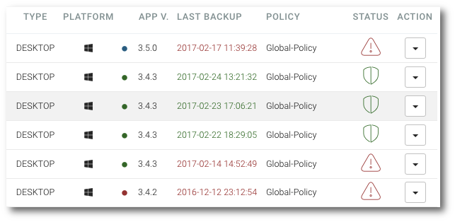

# Client version status

```text
Navigation: Devices
```

On the list of registered device you can check status of current installed client version. Application version is indicated by number and colored dot.

Colored dot indicated application verison:

* **Green color** Installed client is an up-to-date version.
* **Red Colour** The device has an outdated version of the client
* **Blue color** The device has a newer version of client software than the current version configured for the system



