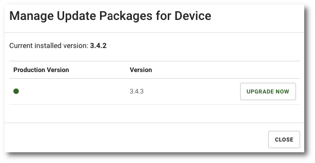

# Send a new client version

```text
Navigate: Devices > ACTION MENU > Upgrade > UPGRADE NOW
```

To send an update to a device, select `Devices` from the main menu and then click the arrow to the right of the table on the line with the device whose data you want to display select`UPGRADE` from the menu.

Select the version you want to install on selected device and click `UPGRADE NOW`



_**Hint:**\_\_ The upgrade process can take from several to tens of minutes depending on network speed\_

**NOTE: Once the update has been downloaded, you must confirm its installation**

