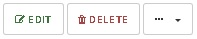

# Removing users

**NOTE: Deleting a user from the system will result in the deletion of all his devices and data!** 

```text
Navigation: Users > Username > DELETE
```

1. **Go to the list of users. Select** `USERS` **from main menu**
2. **Click on the name of the user you want to delete**
3. **Click the** `DELETE` **button and confirm your choice with the**`OK` **button**



or

1. **Go to the list of users. Select** `USERS` **from main menu**
2. **Click the arrow to the right of the table in the user name line**
3. **Select** `DELETE` **from the menu and confirm your choice with the**`OK` **button.**

   

