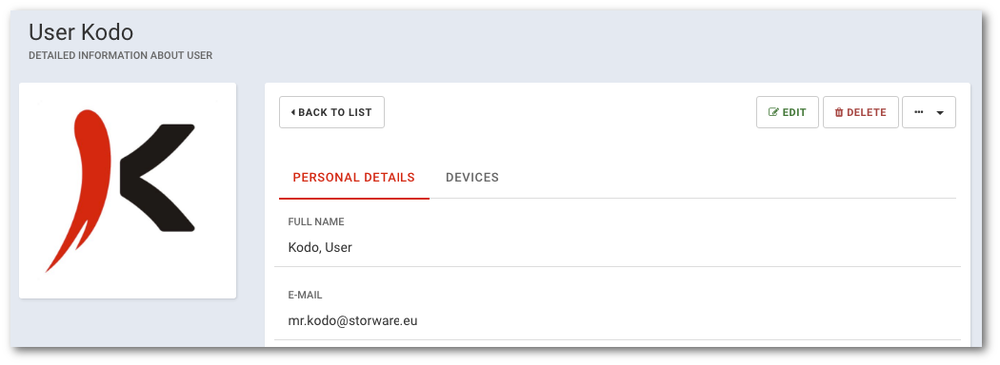

# Detailed information

```text
Navigation: Users > Username
```

Detail user view will display information about user and his devices.



1. **Go to the list of users. Select** `USERS` **from main menu**
2. **Click on the name of the user whose profile you want to view** \*\*

   

or

1. **Go to the list of users. Select** `USERS` **from main menu** 
2. **Click the arrow to the right of the table in the user name line** 
3. **Select** `DETAILS` **from the menu**

   

