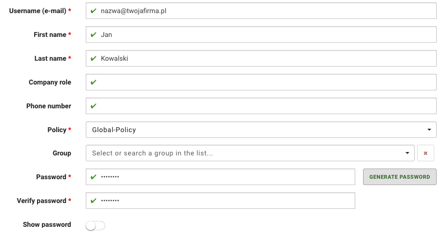
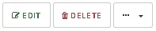

# users\_management

## Users management

The KODO administrator can add new users manually to the system or perform bulk imports synchronizing Open LDAP/Active Directory Server or MDM system \(Famoc & KODO-EMM\) with KODO.

Registered users can use client application to log in to the account and start using KODO features like data protection and sharing.

### Adding local user

```text
Portal navigation: Users > ADD LOCAL USER
```

To register new user perform the following steps:

1. Select `USERS` from main menu
2. Click the `ADD LOCAL USER` button, located atthe top of user list
3. Provide the user account informations:
4. **Username \(e-mail\)** - required
5. **First name** - required 
6. **Last name** - required
7. **Company role** - optional
8. **Phone numner** - optional 
9. **Policy** - required \(user data will be protected according to selected policy\)
10. **Group** - optional
11. **Password** - required
12. **Verify password** - required

Confirm user registration by clicking the `ADD USER` button.



**NOTE: the password must meet the requirements specified in the policy selected for the user**

**TIP: You can use the** `GENERATE PASSWORD` **button to generate a random password for a user that matches your policy. Use the** `Show password` **to show/hide password**

### LDAP and Active Directory users synchronization

```text
Portal navigation: Settings > LDAP
```

The KODO administrator can add LDAP or Active Directory server to the system and synchronize users with KODO.

You might already have a centralized identity management solution in place, which houses information for all users in the company. If you want to make use of that information in KODO, you can synchronize LDAP users with KODO. This will allow to keep user names consistent across applications and allow users to use the same password. This chapter will show how to set up the LDAP synchronization to work with KODO. The document assumes basic knowledge of what LDAP is and how it works.

To configure users synchronization with LDAP complete the following steps:

1. Go to `Settings`
2. Click on `USERS SYNCHRONIZATION` tab
3. As a `Source type` select: LDAP
4. Turn on `Auto Synchronize users` option
5. Set up time for `Auto to synchronization frequnecy`
6. Click on`LDAP` tab

Provide the followind data in **USERS & GROUP LDAP SOURCE** section:

* **Server URL** - LDAP/Active directory server ip or domain address
* **Login** - Username used for synchronization
* **Domain Prefix** - Domain name if different than default
* **Search** - search filter for LDAP service
* **Group filter** - group filter for LDAP service

**NOTE: If you configuring synchronization for the first time before clicking the** `SAVE CHANGES` **button fill the LDAP user password fields.**

Click on the `SAVE CHANGES` button to confirm your changes.


### User Statuses

Each user have status representing its state in the KODO:

* **Active** - Account is active and user can login into the system using the KODO application
* **Locked** - User account is locked and log in to the system is blocked. User can be blocked by administrator or during user synchronization if the account has been removed from the synchronization source.

### List users

```text
Portal navigation: Users
```

To view the list of registered users, select `USERS` from the main menu.


The list of users is displayed as a table with the following columns:

| COLUMN | DESCRIPTION |
| :--- | :--- |
| NAME | First and Last name of user |
| E-MAIL | E-maill address associeted with account |
| GRUPS | The name of the groups to which the user belongs |
| DEVICES | Number of devices associated with the user |
| SOURCE | User Source: local or directory service \(LDAP\) |
| STATUS | Status of the user account |
| ACTION | Quick action menu |

## User details

```text
Portal navigation: Users > USERNAME
```

To display detailed information about user account perform the following steps:


1. Select `USERS` from main menu
2. Click on the name of the user whose profile you want to view

   

**TIP: You can also use Quick Action** `DETAILS` **menu item to display detailed informations about user.**

## Editing user informations

```text
Portal navigation: Users > USERNAME > EDIT
```

**NOTE: You can only edit data of local user.**

Editing allows you to edit informatiob that has been assigned to user account.

1. Select `USERS` from main menu
2. Click on the name of the user you want to edit
3. Click `EDIT` button


**TIP: You can also use Quick Action** `EDIT` **menu item to edit user informations.**

Confirm provided changes by clicking `SAVE CHANGES` button.

## Removing user from the KODO

**NOTE: Deleting a user from the system will result in the deletion of all his devices and data! Use LOCK feature to temporarily suspend user: When browsing detailed informations about users use** `...` **button and select LOCK option.**

```text
Portal navigation: Users > Username > DELETE
```

1. Select `USERS` from main menu
2. Click on the name of the user you want to delete
3. Click the `DELETE` button and confirm your choice with the `OK` button



**TIP: You can also use Quick Action** `DELETE` **menu item to remove user.**

