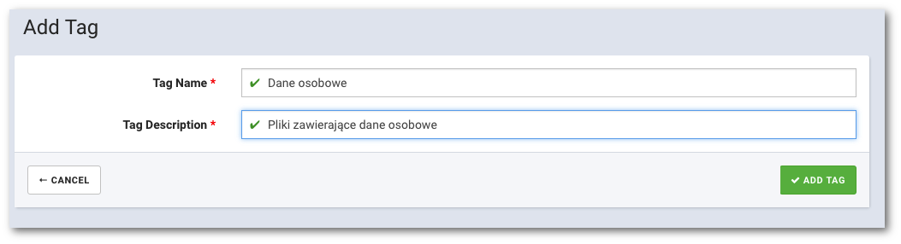

# Dodawanie tagów organizacji

```text
Nawigacja: Data governance -> ADD ORGANIZATION TAG
```

Aby dodać nowy tag organizacji wybierz pozycję `Data governance` z głównego menu, następnie kliknij przycisk `ADD ORGANIZATION TAG` znajdujący się w górnym prawym rogu widoku.


Wypełnij wymagane pola opisujące tag:



* **TAG NAME** Nazwa tagu
* **TAG DESCRIPTION** Opis tagu

Potwierdź dodanie nowego tagu klikając przycisk `ADD TAG`

Od tej pory TAG może być wykorzystywany przez wszystkich użytkowników organizacji.

