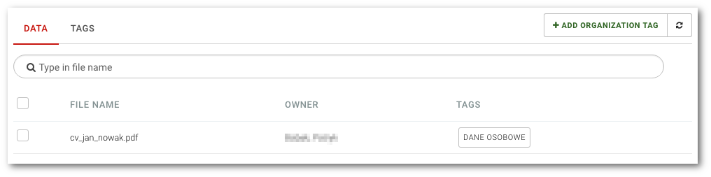

# Przeglądanie danych z wybranym tagiem

```text
Nawigacja: Data governance -> TAGS
```

Aby wyświetlić listę danych z wybranym tagiem wybierz pozycję `Data governance` z głównego menu, następnie kliknij zakładkę TAGS i wybierz ikonę lupy.


Zostaniesz przeniesiony do widoku DATA gdzie zostanie wyświetlona lista wszystkich plików i ich właścicieli z wybranym znacznikiem:



