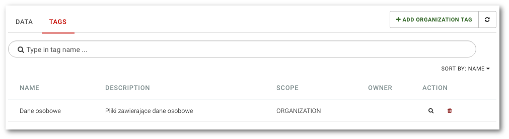

# Lista danych i tagów

```text
Nawigacja: Data governance
```

Aby wyświetlić listę danych oraz tagów zarejestrowanych w systemie wybierz pozycję `Data governance` z głównego menu.


Widok składa się z dwóch zakładek:

* **DATA** Lista plików z wybranym tagiem
* **TAGS** Lista tagów zarejestrowanych w systemie

Aby wyświetlić listę tagów zarejestrowanych w systemie kliknij zakładkę `TAGS`

Lista tagów wyświetlana jest w postaci tabeli z następującymi kolumnami::

* **NAME** Nazwa znacznika
* **DESCRIPTION** Opis znacznika
* **SCOPE** Zasięg znacznika: ORGANIZATION - dla tagów organizacji, USER - dla prywatnych tagów użytkowników
* **OWNER** Nazwa użytkownika, do którego należy tag
* **ACTION** Akcje na tagach: ikona lupy - podgląd danych z tagiem, ikona kosza - usunięcie tagu

