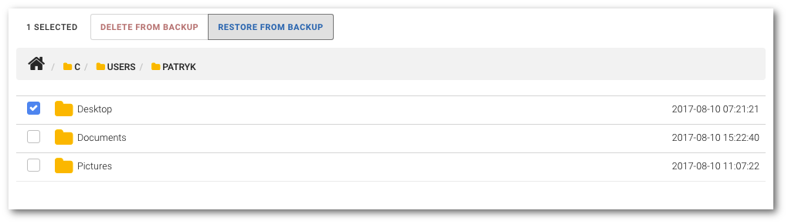

# Odtwarzanie kopii bezpieczeństwa

**UWAGA: Możliwość odtwarzania danych musi zostać włączona w polityce, do której przypisany jest właściciel urządzenia**

```text
Nawigacja: Devices > Nazwa urządzenia > Zakładka PROTECTED FILES
```

Aby usunąć odtworzyć dane wybierz z głównego menu pozycję `Devices` a nastepnie wybierz zakładkę `PROTECTED FILES`.

Z dostępnej listy zaznacz, korzystając z pola wybory przy nazwie obiektu, folder\(y\) lub plik\(i\), które chcesz odtworzyć. Następnie kliknij przycisk `RESTORE FROM BACKUP` i potwierdź przyciskiem `Ok`. Wybrane elementy zostaną spakowane do pliku archiwum ZIP i rozpocznie się proces ich pobierania.




