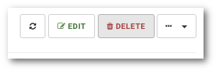

# Usuwanie urządzenia

**UWAGE: Usunięcie urządzenia z systemu będzie skutowało usunięciem wszystkich zabezpieczonych z niego danych!**

```text
Nawigacja: Devices > Nazwa urządzenia > DELETE
```

Aby usunąć z systemu urządzenie wybierz z głównego menu pozycję `Devices` a następnie:

* Kliknij na nazwę urządzenia, które chcesz usunąć, kliknij przycisk `DELETE`

  

lub

* Kliknij strzałkę znajdującą się po prawej stronie tabeli w wierszu z urządzeniem, które chcesz usunąć i wybierz pozycję `DELETE` z menu.

  

Potwierdź wybór przyciskiem `Ok`.

