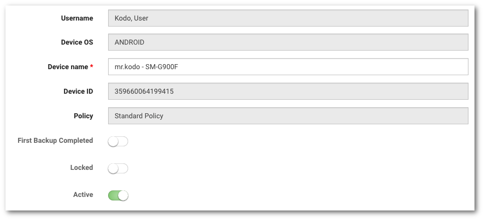

# Edycja danych urządzenia

```text
Nawigacja: Devices > Nazwa urządzenia > EDIT
```

Aby edytować dane urządzenia wybierz z głównego menu pozycję `Devices` a nastepnie:

* Kliknij nazwę urządzenia z dostępnej listy, kliknij przycisk `EDIT`

lub

* Kliknij strzałkę znajdującą się po prawej stronie tabeli w wierszu z urządzeniem, którego dane chcesz edytować wybierz pozycję `EDIT` z menu. 

Wyedytuj wybrane pola:

* **Device name**  _- pole wymagane_  

  Nazwa urządzenia w systemie



Potwierdź zapisanie zmian klikając w przycisk `SAVE CHANGES`

