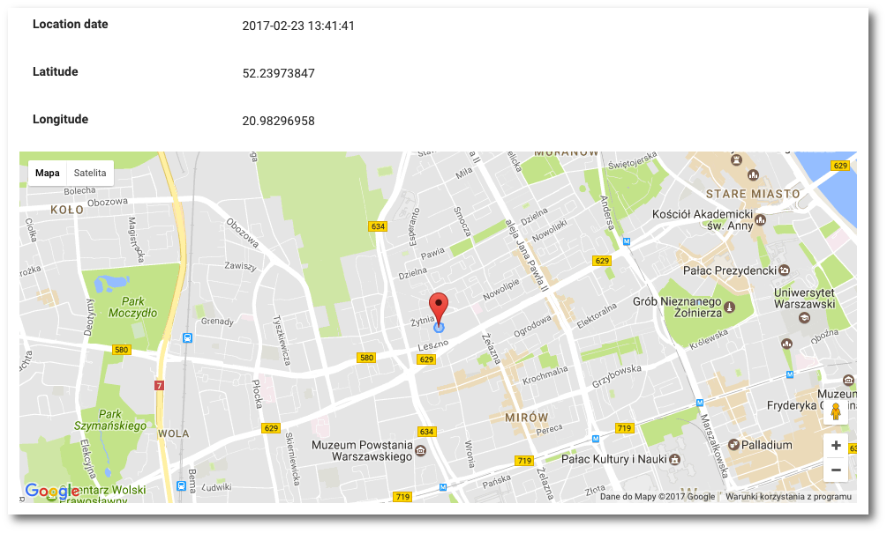

# Lokalizacja urządzenia

**UWAGA: Funcjonalnosć lokalizacji dostepna jest jedynie dla urządzeń mobilnych**

```text
Nawigacja: Devices > Nazwa urządzenia > Zakładka LOCATION
```

Aby sprawdzić ostatnią lokalizacją urządzenia podczas wykonywania kopii bezpieczeństwa wybierz z głównego menu pozycję `Devices` a nastepnie wybierz zakładkę `LOCATION`



