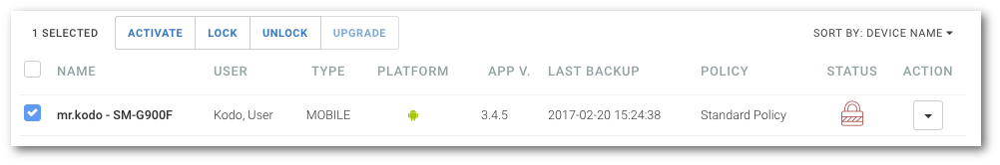

# Blokowanie urządzenia

**UWAGA: Blokowanie dotyczy jedynie urządzeń mobilnych**

```text
Nawigacja: Devices > Nazwa urządzenia > ROZWIJANE MENU > LOCK DEVICE
```

Aby zablokować urządzenie i uniemożliwić logowanie się użytkownika z jego poziomu wybierz pozycję `Devices` z głównego menu a następnie:

* Kliknij nazwę urządzenia z dostępnej listy, kliknij przycisk menu rozwijanego `...` i wybierz pozycję `LOCK DEVICE`

  

lub

* Kliknij strzałkę znajdującą się po prawej stronie tabeli w wierszu z urządzeniem, którego dane chcesz wyświetlić wybierz pozycję `LOCK` z menu.

_**Podpowiedź:**_ _Aby zablokować urządzenie lub wiele urządzeń jednocześnie, z dostępnej listy zaznacz wybrane urządzenie lub urządzenia \(pole wyboru przy nazwie urządzenia\) a następnie z rozwijanego menu, znajdującego się nad listą użytkowników, wybierz pozycję_ `LOCK`_._



