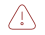
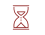

# Statusy urządzeń

Każde urządzenie zarejestrowane w systemie posiada odpowiedni status informujący o jego stanie.

Możliwe statusy urządzeń w systemie:

* **Protected**  Status przedstawiony za pomocą zielonej ikony tarczy. Oznacza, że urządzenie jest aktywne i czas ostatniej komunikacji urządzenia z systemem nie przekroczył wartości podanej w przypisanej do właściciela urządzenia polityce.
* **Not protected**  Status przedstawiony za pomocą czerwonej ikony trójkąta. Oznacza, że urządzenie jest aktywne, ale czas ostatniej komunikacji urządzenia z systemem przekroczył wartość podaną w przypisanej do właściciela urządzenia polityce.
* **Waiting for activation**  Status przedstawiony za pomocą czerwonej ikony klepsydry. Oznacza, że urządzenie jest nieaktywne i oczekuje na aktywację przez administratora. Taki status przypisywany jest dla każdego nowej zarejestorwanego urządzenia.
* **Locked**  Status przedstawiony za pomocą czerwonej ikony kłódki. Oznacza, że urządzenie jest zablokowane i nie ma możliwości komunikowania się z systemem.

