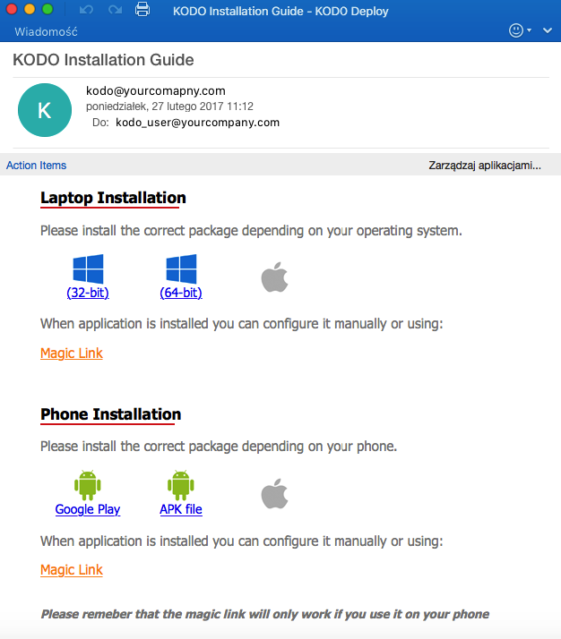

# Instalacja klienta

System KODO umożliwia wysłanie do użytkownika specjalnej wiadomości e-mail zawierającej intrukcje instalacji klienta.

Wiadomość oprócz samej instrukcji zawiera link, który umożliwia pobranie odpowiedniej wersji klienta KODO na dane urządzenie oraz tak zwany "Magick Link".

"Magick Link" jest odnośnikiem, zawierającym specjalny token, który umożliwia wstępną konfigurację klienta KODO oraz w przypadku urządzeń moblinych automatyczną aktywację.

Kliknięcie w "Magick Link" musi nastapić po instalacji klienta KODO oraz na urządzeniu, która ma zostać podłączone do systemu.

Działanie "Magick Linku":

* Uruchomienie zainstalowanego klienta KODO
* Wypełnienie pola adresu serwera, do którego ma zostać podłączony klient
* Wypełnienie nazwy użytkownika, który będzie logować się do systemu
* Zapewnienie aktywacji urządzenia w przypadku urządzeń mobilnych
* Wstępna autoryzacja urządzenia typu dekstop, pozwalająca rozpocząć wykonywania kopii bezpieczeństwa zgodnie z przypisaną polityką

