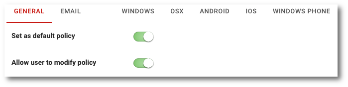

# Podstawow konfiguracja

```text
Nawigacja: Policies > Nazwa polityki > Zakładka GENERAL
```

Zakładka `GENERAL` zawiera podstawową konfigurację polityki nie zależną od rodzaju systemu operacyjnego.



Podstawowa konfiguracja składa się z następujacych elementów:

* **Set as defualt policy** Przełącznik ustawiający politykę jako domyślną
* **Allow user do modify policy** Zezwolenie na modyfikację polityki przez użytkownika \(modyfikacja będzie obejmować jedynie urządzenie, na którym została wykonana\)

## **PRIVACY SETTINGS**

Sekcja umożliwiająca włączenie odzyskiwania danych użytkwników przez administratora

* **Allow administrator to restore user files**  

  Włączenie opcji powoduje możliwość odtwarzania danych przez administratora

## **PASSWORD SETTINGS**

Sekcja umożliwiająca ustawienie wymagań hasła do użytkowników loklanych

* **Minimal password length** Minimalna długość hasła użytkownika
* **Require uppercase letters** Wymaganie wielkich liter w haśle
* **Require lowercase letters** Wymaganie małych liter w haśle
* **Require numbers** Wymaganie cyfr w haśle
* **Require special characters** Wymaganie znaków specjalnych w haśle

## **MOBILE SETTINGS**

Sekcja konfigurująca ogólne ustawienia dla urządzeń mobilnych

* **Allow backups only over WiFi** Zezwalanie na wykonanie kopii bezpieczeństwa tylko gdy urządzenie jest podpięte do sieci WiFi
* **Require PIN authentication** Wymaganie używania kodu PIN podczas logowania do aplikacji
* **Maximum session time** Maksymalny czas \(wyrażany w minutach\), przez który istnieje możliwość logowania się do aplikacji bez ponownego uwierzytelniania jeżeli aplikacja działała w tle
* **Retention period for file versions** Ilość dni, przez które będą trzymane dane w kopii zapasowej po usunięciu ich z urządzenia
* **Maximum number of file versions** Maksymalna ilość wersji danych trzymanych w kopii bezpieczeństwa urządzenia

## **MYKODO SETTNGS**

Sekcja umożliwiająca konfigurację funkcjonalności myKODO

* **myKODO enabled** Włączenie lub wyłączenie funkcjonalności myKODO na urządzeniach
* **Windows location of myKODO folder** Lokalizacja folderu przechowywującego dane myKODO dla systemu Windows
* **macOS location of myKODO folder** Lokalizacja folderu przechowywującego dane myKODO dla systemu macOS
* **File link expiration** Maksymalny czas życia linku do danych udostępnionych przez użytkownika
* **Require password for file links** Wymaganie zabezpieczenia linku do danych udostępnionych przez użytkownika za pomocą hasła
* **Allow sharing folders** Zezwolenie na udostępnianie folderów innych uzytkowników w ramach systemu KODO
* **Allow sharing files via filelink** Zezwolenie na udostępnianie danych za pomoca linków

## **RISK NOTIFICATION SETTINGS**

Sekcja umożliwiająca konfigurację powiadomień użytkownika w przypadku braku wykonywania się kopii bezpieczeństwa na jego urządzeniu

* **Send email notification for unprotected desktops** Włączenie lub wyłączenie powiadomień użytkownika za pomocą wiadomości e-mail o nie wykonaniu kopii bezpieczeństwa dla urządzenia typu desktop
* **Show as desktop "Unprotected" after** Liczba wyrażania w dniach określająca po jakim czasie nie kontaktowania się urządzenia typu dekstop z systemem ma on przejść w status NOT PROTECTED \(urządzenie nie chronione\)
* **Send email notification for unprotected mobiles** Włączenie lub wyłączenie powiadomień użytkownika za pomocą wiadomości e-mail o nie wykonaniu kopii bezpieczeństwa dla urządzenia mobilnego
* **Show as mobile "Unprotected" after** Liczba wyrażania w dniach określająca po jakim czasie nie kontaktowania się urządzenia mobilnego z systemem ma on przejść w status NOT PROTECTED \(urządzenie nie chronione\)

## ENCRYPTION SETTINGS

Tutaj możesz włączyć lub wyłączyć szyfrowanie danych, które są przesyłane przez klienta KODO.

* **Allow users to encrypt their data using own encryption key -** Włącza lub wyłącza możliwość szyfrowania danych przez użytkownika. Jeżeli możliwość szyfrowania jest włączona, użytkownik z poziomu klienta może ustawić własne hasło, dane przed opuszczeniem jego komputera zostaną zaszyfrowane. Jeżeli użytkownik zaszyfruje swoje dane, nie będzie można współdzielić jego kopii bezpieczeństwa z innymi użytkownikami.
* **Enable server-side encryption for myKODO files -** Włącza lub wyłącza szyfrowanie danych, które przechowywane są w myKODO

