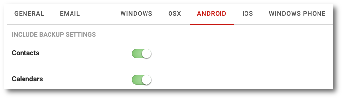

# Ochrona systemów mobilnych

```text
Nawigacja: Policies > Nazwa polityki > Zakładka ANROID/IOS/WINDOWS PHONE
```

Zakładki `ANDROID`, `IOS` oraz `WINDOWS PHONE` umożliwiają konfigurację funkcjonalności kopii bezpieczeństwa dla urządzeń mobilnych



W zależności od możliwości danego systemu operacyjnego zakładki mogą różnić dostępnością poszczególnych opcji.

**INCLUDE BACKUP SETTINGS**  
Sekcja określająca jakie obiekty mają zostać włączone do kopii bezpieczeństwa danego urządzenia.

* **Contacts** Włącza lub wyłącza możliwość wykonywania kopii bezpieczństwa listy kontaktów
* **Calendars** Włącza lub wyłącza możliwość wykonywania kopii bezpieczństwa kalendarzy
* **Galleries** Włącza lub wyłącza możliwość wykonywania kopii bezpieczństwa galerii
  * **Pictures**  

    Włącza lub wyłącza możliwość wykonywania kopii bezpieczństwa zdjęć z galerii

  * **Movies**  

    Włącza lub wyłącza możliwość wykonywania kopii bezpieczństwa filmów z galerii
* **Files** Włącza lub wyłącza możliwość wykonywania kopii bezpieczństwa plików z pamięci urządzenia
* **SD Cards** Włącza lub wyłącza możliwość wykonywania kopii bezpieczństwa danych znajdujących się na karcie SD

**EXCLUDE BACKUP SETTINGS**  
Sekcja określająca jakie obiekty mają zostać wykluczone z kopii bezpieczeństwa danego urządzenia.

* **Files** Wyklucza możliwość wykonywania kopii bezpieczństwa określonych plików z pamięci urządzenia
* **Large files** Wyklucza możliwość wykonywania kopii bezpieczństwa dużych plików
* **Files greater than \[MB\]** Określa rozmiar dla filtra dużych plików

