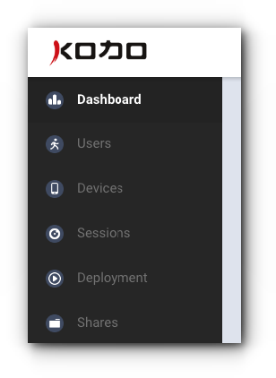

# Budowa portalu

Portal składa się z następujących elementów:

## **Górny pasek**

* Wyszukiwarka
* Ustawienia
* Zarządzanie logowaniem
* Link do portalu wsparcia
* Link do strony producenta 

## **Główne menu**

Główne menu znajduje się z lewej strony portalu i pozwala na poruszanie się pomiędzy poszczególnymi sekcjami.

