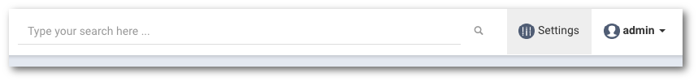

# Podstawowe ustawienia

```text
Nawigacja: Settings
```

Aby przejść do podstawowych ustawień wybierz pozycję `Settings` z górnego paska portalu.



## GENERAL

### **DASHBOARD**

Sekcja pozwala skonfugurować opcje dotyczące wyświetlania głownej strony portalu

* **Refresh dashboard data every \(sec\)**  

  Czas wyrażony w sekundach, określający interwał z jakim będzie odświeżana główna strona portalu

### **USAGE & ACTIVTY REPORT**

Sekcja pozwala skofigurować wysyłanie raportów dotyczących użycia przestrzeni oraz aktywaności urządzeń

* **Send reports every \(days\)** Wartość wyrażana w dniach, określąca interwał z jakim wysyłane są raporty
* **Send reports to \(comma separated emails\)** Adresy e-mail, na które ma został wysałny raport. Wiele adresów e-mail nalezy odzielić przecinkami
* **Send report time** Godzina wysłania raportu

Potwierdź wprowadzone ustawienia przyciskiem `SAVE CHANGES`

### **MASTER PASSWORD**

Sekcja pozwalająca ustawić hasło główne, które wymagane do podania podczas usuwania danych z systemu, czyszczenia urządzenia lub innej aktywności związnej z bezpieczeństwem danych.

* **Password** Ustawienia hasła głównego
* **Verify password** Weryfikacja wprowadzonego hasła głównego

Potwierdzenia zmiany hasła głównego następuje po kliknięciu w przycisk `UPDATE PASSWORD` a następnie potwierdzeniu wybory przyciskiem`Ok`.

## LDAP & USER SYNCHRONIZATION

Ustawienia LDAP & USER SYNCHRONIZATION opisane są w rozdziale [Rejestracja użytkowników](../users/registration.md)

