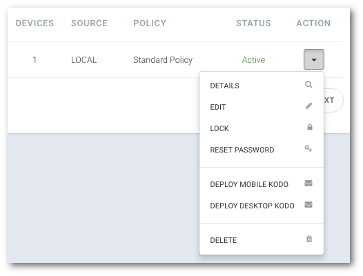

# Usuwanie użytkowników

**UWAGA: Usunięcie użytkownika z systemu będzie skutowało usunięciem jego urządzeń oraz wszystkich zabezpieczonych danych!**

```text
Nawigacja: Users > Nazwa użytkownika > DELETE
```

1. **Przejdź do listy użytkowników. Wybierz pozycję** `USERS` **z główne menu**
2. **Kliknij na nazwę użytkownika, którego chcesz usunąć**
3. **Kliknij przycisk** `DELETE` **i potwierdź swój wybór przyciskiem** `OK`


lub

1. **Przejdź do listy użytkowników. Wybierz pozycję** `USERS` **z główne menu**
2. **Kliknij strzałkę znajdująca się po prawej stronie tabeli w wierszu z nazwą użytkownika**
3. **Wybierz z menu pozycję** `DELETE` **i potwierdź swój wybór przyciskiem** `OK`

   

_**UWAGA: po usunięcie użytkownika, którego źródłem jest serwer usług katalogowych zostanie on ponownie synchronizowany \(jeżeli nie został wykluczony przez ustawienia filtrów\), ale jego konto będzie zablokowane.**_

