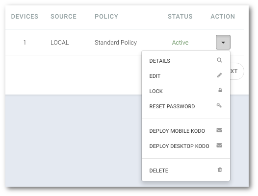

# Informacje szczegółowe

```text
Nawigacja: Users > Nazwa użytkownika
```

Wyświetlenie szczegółowych informacji pozwoli sprawdzić jakie dane zostały przypisane do jego konta:


1. **Przejdź do listy użytkowników. Wybierz pozycję** `USERS` **z główne menu**
2. **Kliknij na nazwę użytkownika, którego profil chcesz obejrzeć**

   

lub

1. **Przejdź do listy użytkowników. Wybierz pozycję** `USERS` **z główne menu**
2. **Kliknij strzałkę znajdująca się po prawej stronie tabeli w wierszu z nazwą użytkownika**
3. **Wybierz z menu pozycję** `DETAILS`   ****

   \*\*

