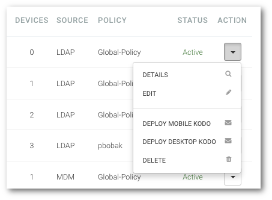

# Edycja danych użytkownika

```text
Nawigacja: Users > Nazwa użytkownika > EDIT
```

**UWAGA: możliwa jest jedynie edycja danych użytkowników zarejestrowanych lokalnie. Dane użytkownika zarejestrowanego z wykorzystaniem usługi katalogowej należy przeprowadzić w samej usłudze a następnie przeprowadzić ponowną synchronizację**

Edycja pozwala Ci na zmianę danych, które zostały przypisane do konta użytkownika.

1. **Przejdź do listy użytkowników. Wybierz pozycję** `USERS` **z główne menu**
2. **Kliknij na nazwę użytkownika, którego chcesz usunąć**
3. **Kliknij przycisk** `EDIT` ****


lub

1. **Przejdź do listy użytkowników. Wybierz pozycję** `USERS` **z główne menu**
2. **Kliknij strzałkę znajdująca się po prawej stronie tabeli w wierszu z nazwą użytkownika**
3. **Wybierz z menu pozycję** `EDIT`



Wyedytuj wybrane pola:

* **First name** _- pole wymagane_ Imię użytkownika.
* **Last name** _- pole wymagane_ Nazwisko użytkownika.
* **Username \(e-mail\)** _- pole wymagane_ Nazwa użytkownika w postaci adresu e-mail.
* **Policy** _- pole wymagane_ Polityka ochrony, do której zostanie przypisany użytkownik.
* **Group** _- pole opcjonalne_ Grupa, do której będzie należeć użytkownik.
* **Company role** _- pole opcjonalne_ Rola użytkownika w organizacji.
* **Phone numner** _- pole opcjonalne_ Numer telefonu.

Potwierdź zapisanie zmian klikając w przycisk `SAVE CHANGES`

