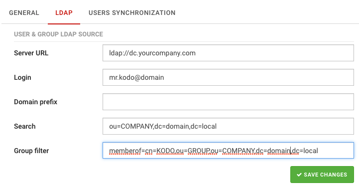
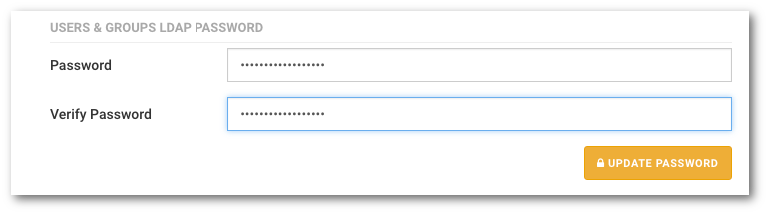

# Użytkownicy usług katalogowych

```text
Nawigacja: Settings > LDAP
```

System KODO pozwala na synchronizację użytkowników, których źródłem są usługi katalogowe \(np. Active Directory\)

Tworząc odpowiednie filtry w szybki i łatwy sposób możesz zasilić KODO definicjami użytkowników.

Użytkownicy logować się będą do systemu KODO \(przez aplikację\) z wykorzystaniem loginu oraz hasła używanego w usługach katalogowych.

## Aby skonfigurować synchronizację użytkowników z usługą katalogową:

1. **Przejdź do ustawień klikając wybierając opcję Settings z górnego prawego rogu**
2. **Przejdź do zakładki** `USERS SYNCHRONIZATION`
3. **Jako źródło synchronizacji \(**`Source type`**\) wybierz:** `LDAP`
4. **Ustaw przełącznik Synchronize users w pozycji włączonej**
5. **Ustaw co ile minut KODO ma synchronizować się z serwerem LDAP \( 0 - brak synchronizacji\)**
6. **Zapisz zmiany przyciskiem** `SAVE CHANGES`

**Ustawienie synchronizacji grup \(Synchronize groups\) nie ma wpływu na synchronizację z serwerem LDAP, opcja ta jest wykorzystywana jedynie w przypadku synchronizacji z systemami MDM.**

Nastepnie:

1. **Przejdź do ustawień klikając wybierając opcję Settings z górnego prawego rog**
2. **Przejdź do zakładki LDAP**

Wypełnij odpowiednie pola:

## **USERS & GROUP LDAP SOURCE**

* **Server URL** Adres serwera usług katalogowych
* **Login** Nazwa użytkownika używanego do synchronizacji
* **Domain Prefix** Prefix domeny jeżeli inny niż domyślny
* **Search** Filtr przeszukiwania usług katalogowych
* **Group filter** Filtr grup synchronizacji użytkowników
* **LDAP Auto Synchronization frequency \(minutes\)** Ilość minut, co którą system będzie automatycznie synchronizował listę uzytkowników z usługą katalogową

**UWAGA: jeżeli przeprowadzasz konfigurację po raz pierwszy przed kliknięciem przycisku** `SAVE CHANGES` **wypełnij niżej opisane pola dotyczące hasła użytkownika używanego do synchronizacji**

Aby potwierdzić wprowadzone zmiany kliknij przycisk `SAVE CHANGES`.



Po zapisaniu zmian system zapytam czy chcesz w tej chiwli zsynchronizować użytkowników, wybranie opcji `Ok` spowoduje próbę podłączenia, autoryzacji i pobrania listy użytkowników z usługi katalogowej.

## **USERS & GROUPS LDAP PASSWORD**

* **Password** Hasła uzytkownika używanego do synchronizacji
* **Verify password** Weryfikacja hasła

Po wypełnieniu niezbędnych pól kliknij przycisk `UPDATE PASSWORD`.



