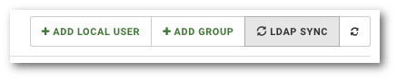

# Synchronizacja użytkowników

```text
Nawigacja: Users > LDAP SYNC
```

Oprócz automatycznej synchronizacji użytkowników może także wywołać synchronizację recznie.

Edycja pozwala Ci na zmianę danych, które zostały przypisane do konta użytkownika.

1. **Przejdź do listy użytkowników. Wybierz pozycję** `USERS` **z główne menu**
2. **Kliknij przycisk** `LDAP SYNC`



